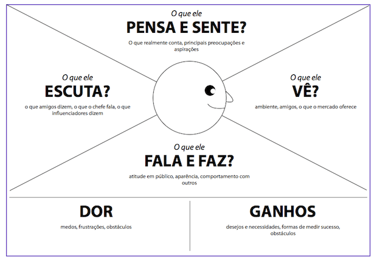

# Personas

#### Persona primária
1. Thiago Alberto Mendes, de 35 anos, é formado em Design de Jogos e atualmente trabalha como Game Director em uma empresa pequena de nome Best Games Studio. Já criou títulos como ATG VI, Armored Lore, Bright Souls. Todos esses jogos possuem características únicas, mas nenhum conseguiu colocar a empresa em posição de destaque. Sua ideia para aumentar o renome da empresa é fazer um título único e inovador.
   Thiago gostaria de adicionar em seu jogo uma mecânica única, que consiga aproximar o jogo e o jogador, de uma forma natural e que adicione elementos de jogabilidade. 
   

2. Valter Alter, de 58 anos, tem um blog e um canal no YouTube de desenvolvimento de jogos chamado ClickGamesBR, com cerca de 1.3 milhões de inscritos. O foco de seu canal é criar, mostrar ao seu público e publicar os jogos na web. Ultimamente, seus seguidores pediram para que fizesse um jogo que interaja com o usuário a partir de suas emoções. Valter tem uma ideia de história, mas necessita que seus seguidores enviem vídeos com webcam e gameplay de diversos jogos, e dessa maneira ele poderia utilizar uma ferramenta que facilite a criação de datasets, a fim de criar o que seus seguidores desejam. 
    

<!--
   
-->
#### Persona secundária
1. Lora Barros, de 21 anos, estudante de ciências da computação tem como principal hobby jogar videogame. Costuma jogar jogos únicos com mecânicas diferentes e impactantes. Como está de férias, busca jogar um novo jogo, algo que possa ser controlado e desenvolvido a partir de identificações de rosto, emoções. Para ela, esse seria o ápice da tecnologia nos jogos eletrônicos.
2. Alberto Bezerra, de 24 anos, estudante de ciências da computação está participando de uma iniciação científica que envolve o desenvolvimento de aplicações com Deep Learning, mas o projeto acabou se estagnando pois o dataset que ele utiliza está desbalanceado. Como está no terceiro semestre da faculdade, ele não compreende completamente o conceito de data augmentation, então ele busca por métodos de criação de datasets usando o próprio rosto para suprir os dados que estão em falta no dataset original.

3. Gabriel Cavalcante, de 43 anos, trabalha como analista de dados na empresa Mind Plus, onde semanalmente necessita criar datasets para outras empresas, cujo foco principal das mesmas é o desenvolvimento de jogos. Essas empresas necessitam de datasets personalizados que consigam envolver o jogo e o jogador. Gabriel precisa de uma ferramenta que facilite a captação da emoção de pessoas enquanto jogam, dessa maneira consegue saber que tipos de jogos causariam, mais conforto, raiva e medo, a fim de auxiliar na criação de uma experiência customizada. 
### Mapa de empatia

<!--
- Determine o mapa de empatia[^1] de pelo menos uma persona primária e uma sercundária.
  - O que o usuário vê: aqui estamos falando do ambiente visual em que o usuário se encontra. Ou seja, o que ele efetivamente enxerga, as pessoas e objetos que estão ao seu redor. Isso ajuda a entender o contexto em que o usuário está inserido e as influências visuais que está recebendo.
  - O que o usuário ouve: neste quadrante, buscamos entender o que o usuário está ouvindo, os sons que o cercam e como eles influenciam suas ações.
  - O que o usuário diz e faz: aqui consideramos ações e comportamentos que o usuário apresenta durante sua interação com serviço ou poduto.
  - O que o usuário pensa e sente: neste quadrante, buscamos entender os pensamentos, sentimentos, emoções e percepções que o usuário tem em relação ao serviço ou poduto. Quais expectativas o usuário cria sobre o serviço ou poduto?
  Que tipo de serviço ou poduto mais agrada essa persona?
  - Dores: quando falamos sobre dores do usuário, estamos fazendo referência a quaisquer obstáculos, necessidades ou frustrações que o usuário possa experimentar ao tentar realizar uma tarefa ou alcançar um objetivo. Isso inclui, por exemplo, problemas de usabilidade, dificuldades de acesso ou outros desafios que podem afetar a experiência do usuário.
  - Ganhos: nesse caso estamos falando de quaisquer benefícios ou recompensas que o usuário possa experimentar ao utilizar o serviço ou poduto. Isso pode incluir economia de tempo ou facilidade de uso, por exemplo. Que desejos do usuário o serviço ou poduto satisfaz?
-->

#### Persona primária: Gabriel Calvacante, 43 anos
- O que o usuário vê: Família bem estruturada; Amigos de classe média-alta, Chefe que demanda desempenho por parte dos funcionários.
- O que o usuário ouve: Precisa passar mais tempo com a família e menos no trabalho; Assiste a canais do YouTube sobre a área de dados.
- O que o usuário diz e faz: Gosta de ler livros que abordam psicologia, desde suspense até estudos científicos; Frquenta lugares de luxo moderado, de forma que a família esteja confortável sem precisar gastar mais do que deve.
- O que o usuário pensa e sente: Preciso estudar para crescer na minha área; Acredito que jogos customizados podem vender mais do que jogos comuns; Compreendo que quanto mais dados a empresa tiver, mais fácil será o trabalho dos funcionários.
- Dores: Sente que passa menos tempo com a família por conta do tempo gasto dentro de seu trabalho; Sente que não atende as demandas de seu chefe, e se conseguisse um facilitador poderia alavancar seus resultados.
- Ganhos: Redução de tempo de trabalho, tanto por parte da pesquisa de um dataset coerente, quanto por parte da criação de um novo; Facilidade ao encontrar novos dados.

#### Persona primária: Valter Alter, 58 anos
- O que o usuário vê: Seus seguidores do Youtube apoiando suas ideias, família bem unida, cenário de game development mais desenvolvido.
- O que o usuário ouve: As ferramentas para realizar seu trabalho estão avançando rapidamente, família apoia muito seu trabalho.
- O que o usuário diz e faz: Gosta de jogar com seus filhos, gosta de produzir jogos e distribuir a seus seguidores. Diz que ama o que faz.
- O que o usuário pensa e sente: Sente que precisa inovar em seu conteúdo e que precisa de ferramentas novas para isso.
- Dores: Sente que ainda não fez um jogo de sucesso e que gostasse. Gostaria de atrair mais pessoas para seu nicho de games.
- Ganhos: Redução do tempo de trabalho e uma produção mais rápida de conteúdo.

#### Persona primária: Thiago Alberto Mendes, 35 anos
- O que o usuário vê: Sua contribuição em desenvolvimento de jogos interessantes, 
- O que o usuário ouve: Que fez bons jogos, que precisa renovar o estado dos games.
- O que o usuário diz e faz: Diz que quer fazer um jogo que seja inovador e muito grande, que precisa criar uma família.
- O que o usuário pensa e sente: Se sente sozinho e estagnado profissionalmente.
- Dores: Não ter feito um jogo muito conhecido, não ter uma família.
- Ganhos: Muita experiência no desenvolvimento de jogos e manejamento de equipes.

#### Persona secundária: Lora Barros, 21 anos
- O que o usuário vê: Amigos bem fiéis, família que apoia suas decisões. Bem disciplinada e sempre tira boas notas.
- O que o usuário ouve: Ouve que deve arrumar logo um emprego, sobre anúncio de novos jogos e sobre evoluções tecnológicas.
- O que o usuário diz e faz: Gosta de jogar videogame e estuda bastante, principalmente programação e tecnologias. Não gosta muito de sair, prefere passar o tempo em casa, seja nos estudos ou nos jogos. Gosta de ler livros técnicos.
- O que o usuário pensa e sente: Queria um jogo revolucionário, com que possa jogar e se divertir com os amigos. Sente que precisa logo arranjar um estágio, pois todos os seus amigos estão começando em um.
- Dores: Precisa logo de um emprego e quer começar a estudar o desenvolvimento de jogos e datasets.
- Ganhos: Ser bem sucedida, ter um foco profissional na área de games e ter vários amigos.

# Mapa de empatia

- Determine o mapa de empatia[1] de pelo menos uma persona primária e uma sercundária.
  - O que o usuário vê: aqui estamos falando do ambiente visual em que o usuário se encontra. Ou seja, o que ele efetivamente enxerga, as pessoas e objetos que estão ao seu redor. Isso ajuda a entender o contexto em que o usuário está inserido e as influências visuais que está recebendo.
  - O que o usuário ouve: neste quadrante, buscamos entender o que o usuário está ouvindo, os sons que o cercam e como eles influenciam suas ações.
  - O que o usuário diz e faz: aqui consideramos ações e comportamentos que o usuário apresenta durante sua interação com serviço ou poduto.
  - O que o usuário pensa e sente: neste quadrante, buscamos entender os pensamentos, sentimentos, emoções e percepções que o usuário tem em relação ao serviço ou poduto. Quais expectativas o usuário cria sobre o serviço ou poduto?
  Que tipo de serviço ou poduto mais agrada essa persona?
  - Dores: quando falamos sobre dores do usuário, estamos fazendo referência a quaisquer obstáculos, necessidades ou frustrações que o usuário possa experimentar ao tentar realizar uma tarefa ou alcançar um objetivo. Isso inclui, por exemplo, problemas de usabilidade, dificuldades de acesso ou outros desafios que podem afetar a experiência do usuário.
  - Ganhos: nesse caso estamos falando de quaisquer benefícios ou recompensas que o usuário possa experimentar ao utilizar o serviço ou poduto. Isso pode incluir economia de tempo ou facilidade de uso, por exemplo. Que desejos do usuário o serviço ou poduto satisfaz?

# Contexto de uso

- Descreva o ambiente em que o serviço ou poduto deve ser utilizado.
- Qual/quais o(s) contexto(s) sociais, econômicos e culturais existentes neste ambiente?
- Quais informações sobre o ambiente, o serviço ou poduto deve guardar antes de iniciar a interação?
- O que normalmente deve estar acontecendo com o ambiente quando o usuário interagir com o serviço ou poduto?

# Jornada do usuário

- Criar uma narrativa para o o seu serviço ou poduto com o usuário.
- Determine o que o usuário realiza desde a primeira até o última interação com o serviço ou poduto.
  - Descreva o que acontece ou pode acontecer passo a passo
  - Como a tarefa começa? Como a tarefa se desenvolve? Como a tarefa termina?

[1] Fonte: Adaptado de <https://hazeshift.com.br/mapa-de-empatia/>
